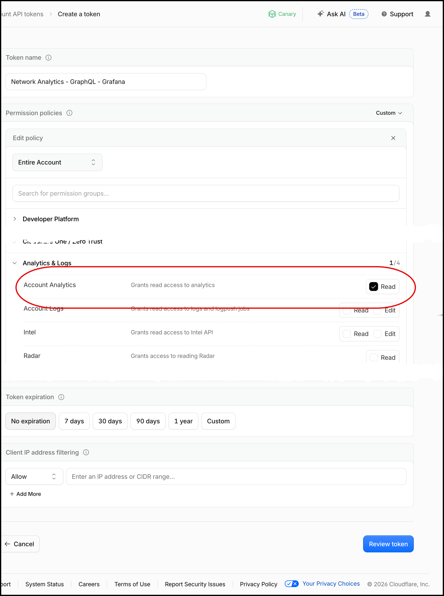
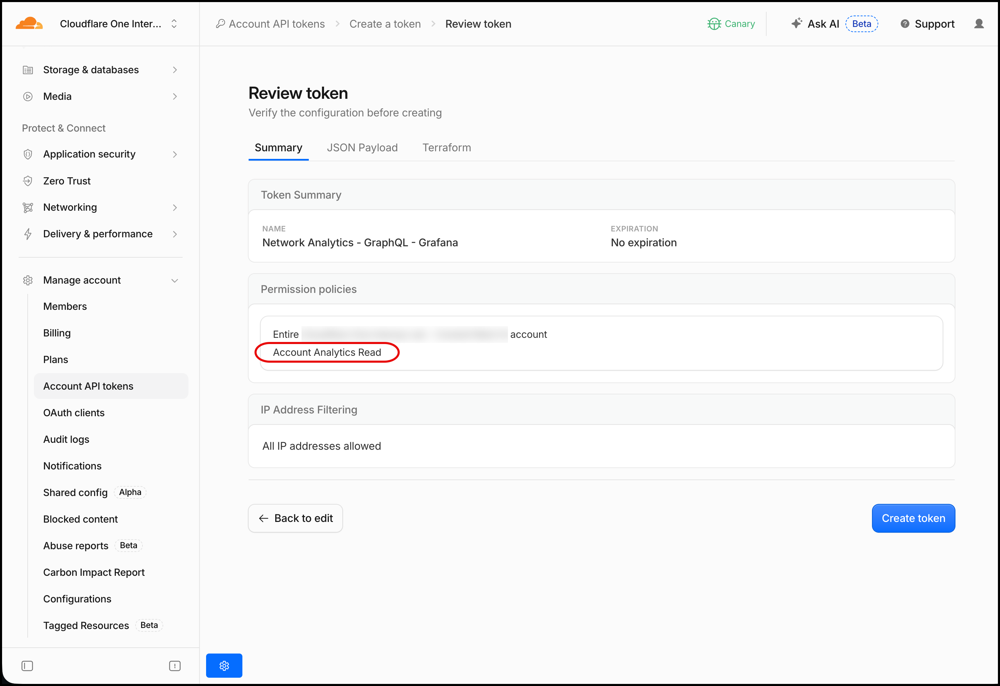
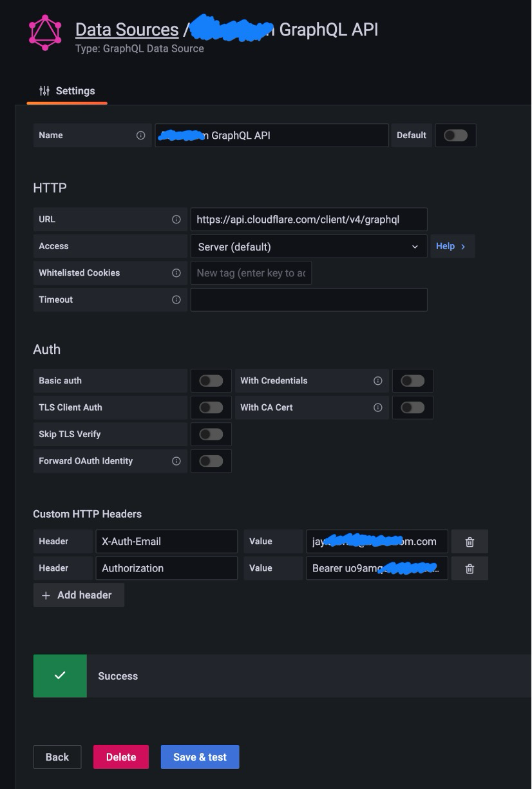
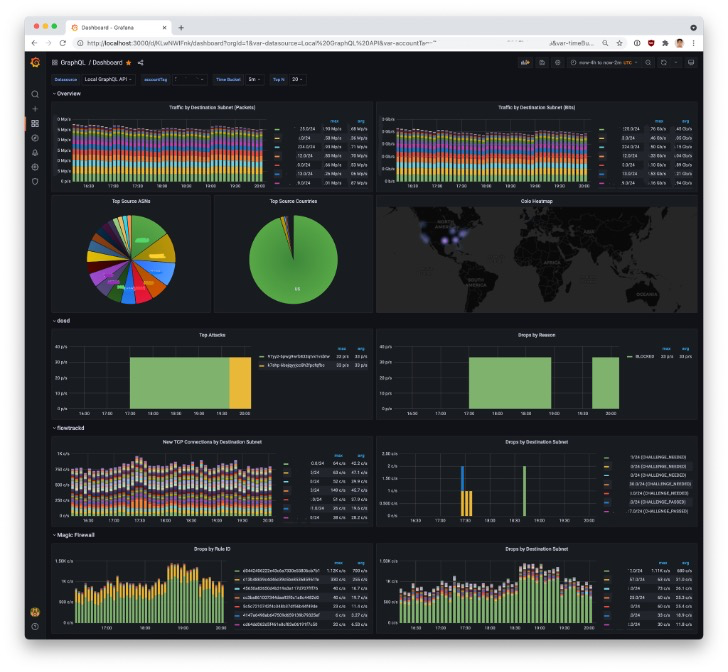

# README - Using Grafana with Cloudflare's Network Analytics GraphQL APIs

Credit for the original version of this document:

Alex Forster
https://gist.github.com/alexforster/5de300e686a4ab1b77d9a3ae5f57270f

## Getting an API Token

First, you'll need to create a "custom" API token. It needs to look like this (you can name it whatever you want).

Use an [Account API Token](https://developers.cloudflare.com/fundamentals/api/get-started/account-owned-tokens/) wherever possible. Traditional API tokens are associated with an individual's user account. If that indivdual's account is deleted, their associated API tokens are invalidated. Account API Tokens ensure API-based integrations continue to work as expected.

- Scope: Account Analytics
- Permission: Read





## Configuring a GraphQL Datasource in Grafana

Next, you need to configure a new GraphQL datasource in Grafana.

**Note:** this assumes that you have a Grafana instance set up, and it has this third-party GraphQL datasource installed: [https://github.com/fifemon/graphql-datasource](https://github.com/fifemon/graphql-datasource)

Your configuration should look like this:



Supply the following URL in the GraphQL data source:

[https://api.cloudflare.com/client/v4/graphql](https://api.cloudflare.com/client/v4/graphql)

Custom HTTP Headers (add both)

```text
X-Auth-Email: your.email@example.com
Authorization: Bearer <BEARER TOKEN>
```

Ensure you leave `Bearer` in the value associated with `Authorization:`.

## Using the Network Analytics API

Now, you can query the new Network Analytics APIs using Grafana.

Here is some general documentation on using Cloudflare GraphQL APIs:

[GraphQL API - Getting Started: https://developers.cloudflare.com/analytics/graphql-api/getting-started/](https://developers.cloudflare.com/analytics/graphql-api/getting-started/)

Here is an example query that gives you the ten-second packet rate of drops, grouped by colo (ie which Cloudflare PoP was the packet handled by) and mitigation system (ie what Cloudflare protection system dropped the packet):

```json
query {
  viewer {
    accounts(filter: {accountTag: "774781d09b5thisisnotvalid9a1a57b"}) {
      magicTransitNetworkAnalyticsAdaptiveGroups(
        limit: 10000
        filter: {
          datetime_geq: "2021-11-01T17:30:00.000Z"
          datetime_lt: "2021-11-01T18:30:00.000Z"
          outcome: "drop"
        }
        orderBy: [datetimeTenSeconds_ASC]
      ) {
        dimensions {
          datetimeTenSeconds
          coloName
          mitigationSystem
        }
        avg {
          packetRateTenSeconds
        }
      }
    }
  }
}
```

**Note:** you need to substitute your own "account tag" in the query above. Your account tag must be included in all GraphQL queries.

## Example Dashboard

We’ve created an example dashboard that can be imported into Grafana and modified to work with your setup:

[https://github.com/jeffh-cloudflare/cf-network-analytics-graphql-grafana/blob/main/cloudflare-network-analytics-grafana-dashboard.json](https://github.com/jeffh-cloudflare/cf-network-analytics-graphql-grafana/blob/main/cloudflare-network-analytics-grafana-dashboard.json)

Here is an example of what this dashboard looks like when it’s been set up:


